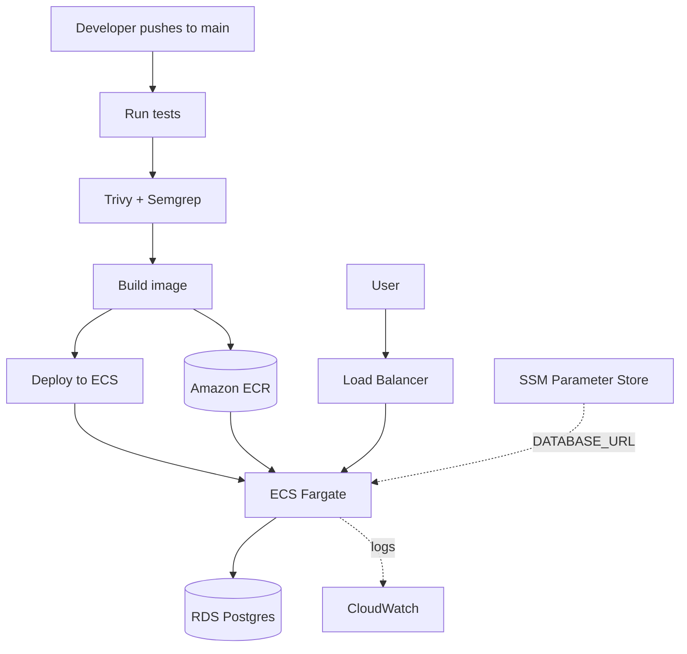
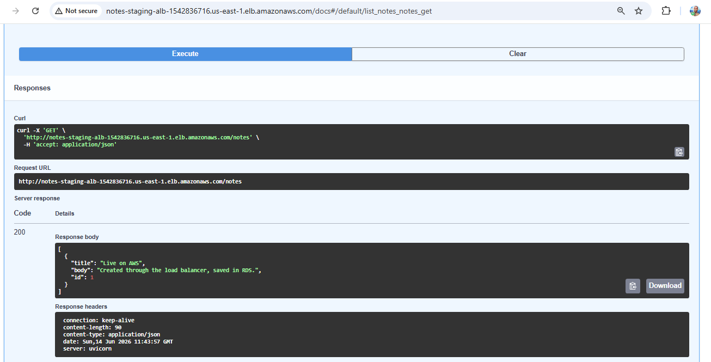
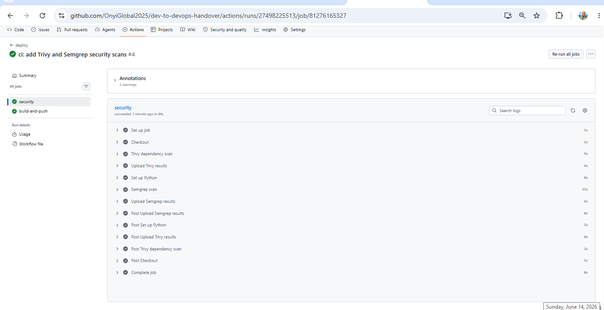
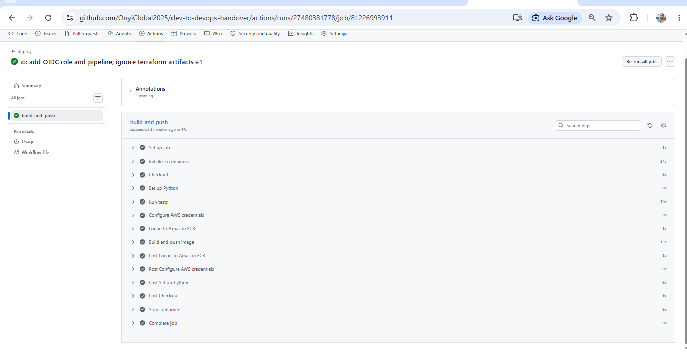
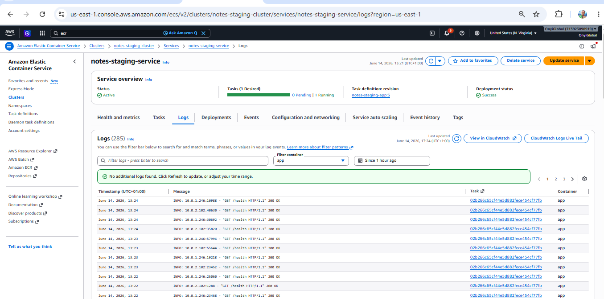

# Developer → DevOps: Application Handover

A demonstration of how a developer hands an application off to a DevOps engineer to take it to production — not just *deploying* an app, but showing the seam between building software and running it.


## What this project shows

Most portfolio projects show a deployed app. This one shows the **handover**: a developer builds an app in "works on my machine" state, a DevOps engineer audits it against production standards, then closes every gap to run it reliably on AWS.

The story runs in three acts:

1. **The developer** builds a small Notes API (FastAPI + Postgres) — functional, but not production-ready: hardcoded config, no container, no health check, secrets in source.
2. **The handover** — a [Production Readiness Review](platform/docs/production-readiness-review.md) audits the app and names every gap, with an owner for each.
3. **The DevOps engineer** closes those gaps: containerizes the app, builds the infrastructure as code, wires a CI/CD pipeline with security scanning, manages secrets, and ships it to production.

## Architecture





## Tech stack

- **Cloud:** AWS — ECS Fargate, ECR, RDS (Postgres), Application Load Balancer, IAM, SSM Parameter Store, CloudWatch
- **Infrastructure as code:** Terraform (remote state in S3)
- **CI/CD:** GitHub Actions with OIDC (no long-lived keys)
- **Security:** Trivy (dependency scanning), Semgrep (SAST)
- **App:** FastAPI, Docker

## CI/CD pipeline

On every push to `main`:

1. Run the test suite against a throwaway Postgres.
2. Scan with Trivy and Semgrep; results upload to the Security tab.
3. Build the container image and push it to ECR (tagged `latest` and the commit SHA).
4. Deploy automatically to the ECS service.

No images are built or pushed from a laptop — the pipeline does it on stable infrastructure.





## Repository layout

```
app/        the developer's deliverable (the application)
platform/   the DevOps domain
  terraform/   infrastructure as code (ECS, ALB, RDS, IAM, networking)
  docs/        production-readiness-review.md, runbook.md
.github/workflows/   the CI/CD pipeline
```

## Key decisions

- **ECS Fargate, not Kubernetes** — real container orchestration without the operational weight of EKS.
- **Cost-shaped networking** — tasks run in public subnets so they pull images without a NAT Gateway; the database sits in isolated private subnets.
- **Secrets via SSM Parameter Store** — the database URL is injected at runtime and never lives in code, the image, or git.
- **Least-privilege security groups** — the internet reaches only the load balancer, the load balancer reaches only the app, the app reaches only the database.

## Running it

The environment is created and destroyed per session to control cost. See the [runbook](platform/docs/runbook.md) for full operations.

```bash
cd platform/terraform/environments/staging
terraform apply
# then push to main (or re-run the pipeline) to build and deploy the image
terraform output app_url
```


